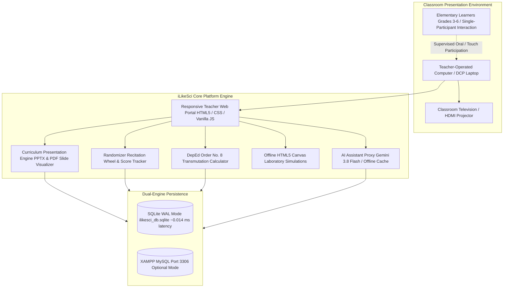

# APPENDIX F: USER’S MANUAL
## iLikeSci: A Science Teaching Material System for Grades 3 to 6 Science Teachers at Bay Central Elementary School

> **A Capstone Project**  
> Presented to the Faculty of the  
> **College of Computer Studies**  
> **Laguna State Polytechnic University**  
> San Pablo City Campus, San Pablo City, Laguna  
>  
> In Partial Fulfillment of the Requirements for the Degree  
> **Bachelor of Science in Information Technology**  
> Specialized in Web and Mobile Application Development  
>  
> **Researchers / Proponents:**  
> Abril, John Dondell A.  
> Millera, Kristine Andrea H.  
> Olidan, Christian Angelo E.  
>  
> **Capstone Project Adviser:** Ma’am Criselda Encanto  
> **Partner School / Deployment Site:** Bay Central Elementary School (BCES), Bay, Laguna  
> **Target Beneficiaries:** Grades 3 to 6 Science Teachers & Elementary Learners  
> **Curriculum Domains:** Enhanced Science Curriculum — Life Science & Matter and Materials  
> **Academic Year:** 2026–2027  

---

## TABLE OF CONTENTS

1. [Project Overview & Instructional Philosophy](#1-project-overview--instructional-philosophy)
2. [Hardware & Software System Requirements](#2-hardware--software-system-requirements)
3. [System Launching & Operation Modes](#3-system-launching--operation-modes)
   - [3.1 Mode A: One-Click XAMPP Localhost Launcher (`start_localhost.bat`)](#31-mode-a-one-click-xampp-localhost-launcher-start_localhostbat)
   - [3.2 Mode B: Ultra-Low RAM Standalone Mode (`start_ilikesci.bat`)](#32-mode-b-ultra-low-ram-standalone-mode-start_ilikescibat)
   - [3.3 Mode C: Standalone Interactive Control Panel (`standalone_control_panel.bat`)](#33-mode-c-standalone-interactive-control-panel-standalone_control_panelbat)
   - [3.4 Mode D: Cloud Production Deployment (AWS EC2 / HTTPS)](#34-mode-d-cloud-production-deployment-aws-ec2--https)
4. [User Authentication & Role-Based Safeguards](#4-user-authentication--role-based-safeguards)
   - [4.1 Default Accounts & Authorized Roles](#41-default-accounts--authorized-roles)
   - [4.2 Teacher Load Protection & DepEd Safeguards](#42-teacher-load-protection--deped-safeguards)
5. [System Modules & Step-by-Step Operator Guide](#5-system-modules--step-by-step-operator-guide)
   - [5.1 Module 1: Login Interface (Figure 21)](#51-module-1-login-interface-figure-21)
   - [5.2 Module 2: Teacher Dashboard Interface (Figure 22)](#52-module-2-teacher-dashboard-interface-figure-22)
   - [5.3 Module 3: Assessments & Digital Recitation Interface (Figure 23)](#53-module-3-assessments--digital-recitation-interface-figure-23)
   - [5.4 Module 4: Student Performance Overview / Leaderboards (Figure 24)](#54-module-4-student-performance-overview--leaderboards-figure-24)
   - [5.5 Module 5: Student Management Interface (Figure 25)](#55-module-5-student-management-interface-figure-25)
   - [5.6 Module 6: Lesson Delivery Interface & TV Presentation (Figure 26)](#56-module-6-lesson-delivery-interface--tv-presentation-figure-26)
   - [5.7 Module 7: Multimedia Library & Simulations Interface (Figure 27)](#57-module-7-multimedia-library--simulations-interface-figure-27)
   - [5.8 Module 8: Interactive Educational Games Interface (Figure 28)](#58-module-8-interactive-educational-games-interface-figure-28)
   - [5.9 Module 9: Question Bank Interface & AI Generation (Figure 29)](#59-module-9-question-bank-interface--ai-generation-figure-29)
   - [5.10 Module 10: Student Records & Grading Interface — DepEd Order No. 8 (Figure 30)](#510-module-10-student-records--grading-interface--deped-order-no-8-figure-30)
   - [5.11 Module 11: Teacher Account Management & Profile Interface (Figure 31)](#511-module-11-teacher-account-management--profile-interface-figure-31)
   - [5.12 Module 12: Central System Administration Page (Figure 32)](#512-module-12-central-system-administration-page-figure-32)
6. [AI Teaching Assistant Configuration (Google Gemini 3.8 Flash)](#6-ai-teaching-assistant-configuration-google-gemini-38-flash)
7. [System Maintenance, Backups & Verification Audits](#7-system-maintenance-backups--verification-audits)
8. [Frequently Asked Questions (FAQ)](#8-frequently-asked-questions-faq)

---

## 1. PROJECT OVERVIEW & INSTRUCTIONAL PHILOSOPHY

**iLikeSci: A Science Teaching Material System for Grades 3 to 6 Science Teachers at Bay Central Elementary School** is an offline-first, teacher-controlled, web-based instructional platform developed to support elementary Science educators. In Philippine basic education, teachers routinely face obstacles such as fragmented digital materials scattered across USB flash drives, time-consuming classroom transitions between different file formats, absent or unstable classroom internet connectivity, and the labor-intensive manual tracking of recitation scores and grading records.

iLikeSci resolves these challenges by centralizing curriculum-aligned instructional content, interactive simulations, presentation decks, classroom games, digital recitation tools, and grading sheets within a single, unified environment.

### 1.1 Target School Context & Learners
- **Deployment Site:** Bay Central Elementary School (BCES), District of Bay, Division of Laguna.
- **Participating Cohort:** Grades 3, 4, 5, and 6 Science Teachers.
- **Student Roster:** Official BCES learner masterlists:
  - **Grade 4:** 252 learners (129 male, 123 female) across sections *Einstein*, *Newton*, *Galileo*, and *Pasteur*.
  - **Grade 6:** 232 learners (107 male, 125 female) across sections *Diamond*, *Ruby*, *Emerald*, and *Sapphire*.
  - **Total Enrolled Learners:** 484 active students managed in the system.

### 1.2 Curriculum Scope & Learning Domains
Content in iLikeSci is explicitly aligned with the **Enhanced Basic Education Science Curriculum** and the Department of Education’s Least-Learned Competencies:
1. **Life Science (Living Things and Their Environment):** Body systems, plant/animal habitats, life cycles, and ecosystems.
2. **Matter and Materials (Properties and Changes in Matter):** Properties of solids, liquids, and gases; changes in materials under temperature variations; useful vs. harmful materials.

### 1.3 Teacher-Controlled Classroom Setting
iLikeSci is operated from the teacher’s laptop or desktop computer and projected onto the classroom television or smartboard. Students participate actively through teacher-facilitated activities—such as the randomized recitation wheel, flash quizzes, and educational games—one student at a time, without requiring individual mobile phones, tablets, or student accounts.



---

## 2. HARDWARE & SOFTWARE SYSTEM REQUIREMENTS

The system is engineered to run seamlessly on low-specification computers commonly distributed under the **DepEd Computerization Program (DCP)**.

| System Component | Minimum Standalone Specification | Recommended Multi-User / Lab Setup |
|---|---|---|
| **Central Processor (CPU)** | Intel Celeron N4000 / AMD A4 (Dual Core, 1.1 GHz) | Intel Core i3 / AMD Ryzen 3 or higher |
| **System Memory (RAM)** | **2 GB RAM** (System memory consumption: ~18 MB) | 4 GB to 8 GB RAM |
| **Available Disk Storage** | 500 MB free hard drive or SSD space | 1 GB free SSD storage |
| **Operating System** | Windows 7 / 8.1 / 10 / 11 (32-bit or 64-bit) | Windows 10/11 or Ubuntu Linux 22.04 LTS |
| **Display Resolution** | 1024 x 768 pixels (Standard 4:3 Classroom Projector) | 1920 x 1080 pixels (Full HD Smart TV) |
| **Web Browser Compatibility** | Google Chrome 80+, Microsoft Edge 80+, Mozilla Firefox 75+ | Google Chrome (Latest Version) |
| **Web Server & Backend** | Built-in PHP 7.4+ or 8.0+ CLI (Zero-installation portable) | XAMPP 8.0+ (Apache 2.4 + PHP 8.1 + MySQL 8.0) |
| **Internet Connection** | **100% Offline Capable** (No internet needed for lessons) | Broadband Internet (Only required for live AI prompts) |

---

## 3. SYSTEM LAUNCHING & OPERATION MODES

To ensure zero technical friction for elementary teachers, automated Windows batch scripts located in the root installation folder handle all server initialization, port checks, and browser launching automatically.

### 3.1 Mode A: One-Click XAMPP Localhost Launcher (`start_localhost.bat`)
Recommended when XAMPP is installed on the school laptop or computer laboratory server.
1. Open the project directory: `C:\xampp\htdocs\ILikeSci\`.
2. Double-click:
   ```bat
   start_localhost.bat
   ```
3. The automated script will:
   - Detect the XAMPP directory dynamically.
   - Silently verify and start MySQL (Port 3306) and Apache (Port 80).
   - Automatically launch your default browser to:  
     `http://localhost/ILikeSci/index.html`

### 3.2 Mode B: Ultra-Low RAM Standalone Mode (`start_ilikesci.bat`)
Designed for older laptops with limited RAM. Requires no XAMPP, no Apache installation, and no MySQL server.
1. Double-click:
   ```bat
   start_ilikesci.bat
   ```
2. A lightweight PHP server starts instantly on port `8000`, using SQLite. Total memory usage remains below **18 MB of RAM**.
3. The portal opens automatically at:  
   `http://127.0.0.1:8000`

### 3.3 Mode C: Standalone Interactive Control Panel (`standalone_control_panel.bat`)
Provides school ICT coordinators with real-time operational status, stack control, diagnostics, and database re-seeding options.
1. Double-click:
   ```bat
   standalone_control_panel.bat
   ```
2. Choose from the interactive menu:
   - `[1] Start Ultra-Low RAM Mode (127.0.0.1:8000)`
   - `[2] Start Full XAMPP Stack (Apache + MySQL)`
   - `[3] Stop All Running Server Daemons`
   - `[4] Run Full System Diagnostics & Production Test Suite`
   - `[5] Re-seed Database with Official BCES Masterlists`
   - `[6] Exit`

### 3.4 Mode D: Cloud Production Deployment (AWS EC2 / HTTPS)
When internet access is available, teachers and school administrators can access the system remotely:
- **Cloud Portal URL:** `https://ilikesci.duckdns.org`
- **Security:** Automated HTTPS encryption via Let’s Encrypt TLS/SSL.
- **Server Infrastructure:** Nginx reverse proxy with PHP-FPM 8.2 on Amazon Linux 2023.

---

## 4. USER AUTHENTICATION & ROLE-BASED SAFEGUARDS

### 4.1 Default Accounts & Authorized Roles

| Role | Username | Password | Designated Assignment | Scope of Authority |
|---|---|---|---|---|
| **School Administrator** | `oyo` | `admin123` | School ICT / Principal | Full administrative oversight, user management, and global database backups |
| **Primary Science Teacher** | `coney` | `Password123!` | Grade 4 Science | Teaching Load: Einstein, Newton, Galileo, Pasteur (Locked to Grade 4) |
| **Secondary Science Teacher** | `tine` | `teacher123` | Grade 6 Science | Teaching Load: Diamond, Ruby, Emerald, Sapphire |

### 4.2 Teacher Load Protection & DepEd Safeguards
In compliance with strict data privacy and foolproofing guidelines:
1. **Teaching Load Immutability:** Non-admin teachers cannot alter their assigned grade level or section in `profile.html`. Ma’am Coney’s account is locked to Grade 4 with the status badge `(Managed by School Administrator)`.
2. **Curriculum Isolation:** Questions, curriculum slide presentations, and student rosters automatically filter to the logged-in teacher’s assigned grade. Cross-grade alterations are rejected with `403 Forbidden`.
3. **Student Cascading Deletion:** Deleting a student cascades immediately to linked recitation logs and quarterly grade sheets, eliminating orphaned database rows.
4. **Permanent Account Protection:** Critical accounts (`oyo` and `coney`) cannot be deleted or renamed through user management endpoints.

---

## 5. SYSTEM MODULES & STEP-BY-STEP OPERATOR GUIDE

### 5.1 Module 1: Login Interface (Figure 21)
The **Login Interface** serves as the security gateway for teachers and administrators.

```
+-----------------------------------------------------------------------------------+
|                            [ATOM LOGO] iLikeSci                                    |
|                      Science Teaching Material System                             |
|                    Bay Central Elementary School (Grades 3-6)                     |
+-----------------------------------------------------------------------------------+
|                                                                                   |
|                                TEACHER LOGIN                                      |
|                                                                                   |
|        Username:    [ coney________________________ ]                             |
|        Password:    [ ************_________________ ] [Eye Icon]                  |
|                                                                                   |
|        [ BUTTON: LOG IN TO CLASSROOM PORTAL ]                                     |
|                                                                                   |
|        Don't have an account? Sign Up | Need help? Contact ICT Administrator      |
+-----------------------------------------------------------------------------------+
```

#### Operating Instructions:
1. Open the system launcher or navigate to `login.html`.
2. Enter your authorized username (e.g., `coney`) and password.
3. Toggle the password visibility eye icon to verify spelling if needed.
4. Click **Log In**. The server authenticates credentials and redirects you to the Teacher Dashboard.

---

### 5.2 Module 2: Teacher Dashboard Interface (Figure 22)
The **Teacher Dashboard** is the main instructional control center, allowing quick access to all classroom tools.

```
+-----------------------------------------------------------------------------------+
| [ATOM] iLikeSci                      [Learn] [Practice] [Leaderboard] [Moon] [Door]|
+-----------------------------------------------------------------------------------+
|                                                                                   |
|  WELCOME, MA'AM CONEY!                                                            |
|  Assigned Load: Grade 4 Science | Bay Central Elementary School                   |
|                                                                                   |
|  +---------------------+  +---------------------+  +---------------------+        |
|  | 📚 Lessons & Slides |  | 🎯 Flash Quiz       |  | 🎡 Recitation Wheel |        |
|  | 54 Curriculum Units |  | Grade 4 Question Bank| | Fair Participation  |        |
|  +---------------------+  +---------------------+  +---------------------+        |
|  +---------------------+  +---------------------+  +---------------------+        |
|  | 🧪 Lab Simulations  |  | 📊 DepEd Grades     |  | 🎮 Classroom Games  |        |
|  | HTML5 Canvas Labs   |  | DepEd Order No. 8   |  | 4 Pics 1 Word / Team|        |
|  +---------------------+  +---------------------+  +---------------------+        |
|                                                                                   |
|  SELECTED DOMAIN: Matter and Materials & Life Science (Quarter 1 to Quarter 4)    |
+-----------------------------------------------------------------------------------+
```

#### Operating Instructions:
1. Review the quick summary statistics (total enrolled students, active lessons, recitations today).
2. Click on any module card to enter that functional area.
3. Use the top navigation bar to jump between **Learn** (`index.html`), **Practice** (`assessment.html`), and **Leaderboard** (`scoreboard.html`).
4. Click the moon/sun icon to toggle between dark and light classroom themes.

---

### 5.3 Module 3: Assessments & Digital Recitation Interface (Figure 23)
Facilitates randomized, stress-free student recitation and classroom quizzes.

```
+-----------------------------------------------------------------------------------+
|  🎡 RECITATION RANDOMIZER & QUIZ ENGINE                                           |
+---------------------------------------------------+-------------------------------+
|  Grade: [ Grade 4  v ]   Section: [ Einstein v ]  |  SELECTED PARTICIPANT:        |
|                                                   |  ALVAREZ, SOFIA MAE           |
|                    [  WHEEL  ]                    |  Section: Einstein (Grade 4)  |
|                 /             \                   |                               |
|                |    SPIN ME    |                  |  Question Prompt:             |
|                 \             /                   |  Which material absorbs       |
|                    [  WHEEL  ]                    |  water quickly?               |
|                                                   |                               |
|            [ BUTTON: SPIN THE WHEEL ]             |  [A] Plastic Sheet            |
|                                                   |  [B] Cotton Sponge  (Correct) |
|  Evaluation Rubric:                               |  [C] Rubber Band              |
|  ( ) Correct (+3)   ( ) Partial (+2)  ( ) Pass    |  [D] Aluminum Foil            |
|                                                   |                               |
|  [ SUBMIT RECITATION SCORE ]                      |  Total Recitations: 7         |
+---------------------------------------------------+-------------------------------+
```

#### Operating Instructions:
1. Select the active **Section** (e.g., *Einstein*). The grade is auto-locked to your teaching load.
2. Click **Spin the Wheel**. The canvas spins and randomly selects an enrolled student from the official BCES roster.
3. The selected student stands and answers the scientific question displayed on screen.
4. Select the evaluation rubric: **Correct (+3)**, **Partial (+2)**, or **Pass/Effort (+1)**.
5. Click **Submit Recitation Score**. Points are instantly logged to the student’s academic profile.

---

### 5.4 Module 4: Student Performance Overview / Leaderboards (Figure 24)
Visualizes classroom participation, stars earned, and student engagement rankings.

#### Operating Instructions:
1. Navigate to **Leaderboard** (`scoreboard.html`).
2. Filter by Grade and Section to view top-participating learners.
3. Click **Print Scoreboard** to generate a clean, high-contrast physical copy formatted for classroom bulletin boards.

---

### 5.5 Module 5: Student Management Interface (Figure 25)
Houses the official BCES learner masterlists and section rosters.

```
+-----------------------------------------------------------------------------------+
|  STUDENT MANAGEMENT ROSTER                                   [+ Add New Student]  |
|  Filter Grade: [ Grade 4 v ]   Filter Section: [ Einstein v ]   Search: [_______] |
+-----+-----------------------------------+-------+----------+--------+-------------+
| LRN | Student Name (DepEd Official)     | Grade | Section  | Recit. | Actions     |
+-----+-----------------------------------+-------+----------+--------+-------------+
| 001 | ABRIL, JOHN CARLO M.             | 4     | Einstein | 4      | [Edit] [Del]|
| 002 | ALVAREZ, SOFIA MAE D.             | 4     | Einstein | 7      | [Edit] [Del]|
| 003 | BALMES, CHRISTIAN DAVE P.         | 4     | Einstein | 3      | [Edit] [Del]|
| 004 | CASTILLO, PRINCESS NICOLE R.      | 4     | Einstein | 6      | [Edit] [Del]|
+-----+-----------------------------------+-------+----------+--------+-------------+
```

#### Operating Instructions:
1. Filter students by section (*Einstein*, *Newton*, *Galileo*, *Pasteur* for Grade 4; *Diamond*, *Ruby*, *Emerald*, *Sapphire* for Grade 6).
2. To add a learner, click **+ Add New Student**, enter the LRN, name, grade, and section, and click **Save**.
3. To delete or edit a record, click the respective action buttons. Deleting automatically cascades to linked grades and recitation logs.

---

### 5.6 Module 6: Lesson Delivery Interface & TV Presentation (Figure 26)
Delivers fullscreen visual PowerPoint and PDF presentations without requiring commercial presentation software.

#### Operating Instructions:
1. Select the desired lesson unit (e.g., *Changes in Matter Under Heat*).
2. Click **Open in Presenter**.
3. Use the arrow keys (`Left` / `Right`) or a wireless presenter clicker to navigate slides.
4. Press `T` to toggle the visual thumbnail drawer.
5. Click the pen icon to draw annotations directly over slide illustrations on the TV screen.

---

### 5.7 Module 7: Multimedia Library & Simulations Interface (Figure 27)
Centralizes videos, audio songs, diagrams, and offline HTML5 laboratory simulations.

#### Operating Instructions:
1. Open **Multimedia Library** (`multimedia.html`).
2. Launch interactive Canvas simulations:
   - **Molecular States of Matter:** Drag the temperature slider to heat ice crystals into water and vapor.
   - **Circuit Builder:** Connect copper wires, switches, batteries, and bulbs to test conductivity.
   - **Photosynthesis Chamber:** Adjust sunlight and carbon dioxide to observe oxygen production.
3. Access 15 offline MIDI curriculum science songs via the built-in Web Audio synthesizer.

---

### 5.8 Module 8: Interactive Educational Games Interface (Figure 28)
Engages the class through interactive group games projected on the screen.

#### Operating Instructions:
1. **4 Pics 1 Word (Science Edition):** Four pictures appear representing a scientific concept. Call students to unscramble letter tiles on the smartboard.
2. **Science Groupings Generator:** Select the active section, specify the desired group size (e.g., 5 students per team), and click **Generate Teams**. The algorithm generates balanced collaborative teams randomly.

---

### 5.9 Module 9: Question Bank Interface & AI Generation (Figure 29)
Enables teachers to maintain curriculum questions, filter by cognitive difficulty, or generate new questions using AI.

#### Operating Instructions:
1. Filter questions by Grade, Quarter, and Topic.
2. Click **+ Add Question** to manually create Multiple Choice, Identification, or Enumeration questions.
3. Click **AI Generate** to have Google Gemini 3.8 Flash automatically propose curriculum-aligned questions for the selected topic.

---

### 5.10 Module 10: Student Records & Grading Interface — DepEd Order No. 8 (Figure 30)
Automates quarterly grading calculations according to DepEd Order No. 8, s. 2015.

$$\text{Initial Grade} = (\text{Written Work } 40\%) + (\text{Performance Tasks } 40\%) + (\text{Quarterly Assessment } 20\%)$$

#### Operating Instructions:
1. Open **E-Class Records** (`records.html`).
2. Select **Grade**, **Section**, and **Quarter**.
3. Enter raw scores for Written Works, Performance Tasks, and the Quarterly Exam.
4. The system calculates the percentage score, initial grade, and transmuted grade (60% raw = 75 passing) in real time.
5. Click **Export Records (CSV)** to download an electronic spreadsheet ready for transfer to the school’s official SF9 / Form 137.

---

### 5.11 Module 11: Teacher Account Management & Profile Interface (Figure 31)
Allows teachers to personalize account credentials and visual themes.

#### Operating Instructions:
1. Open **User Profile** (`profile.html`).
2. Update display name, bio, or profile avatar.
3. Change your password, ensuring it meets security complexity rules.
4. Note that teaching load (Grade and Section) is locked and managed by the school administrator.

---

### 5.12 Module 12: Central System Administration Page (Figure 32)
Restricted to the School Administrator (`oyo`) for technical configuration and oversight.

#### Operating Instructions:
1. Log in with administrator credentials and navigate to `admin.html`.
2. Access the six administrative tabs:
   - **Dashboard:** Review school-wide recitation and usage statistics.
   - **Users:** Create, update, or deactivate teacher accounts.
   - **Questions:** Perform global question bank audits and bulk imports.
   - **Files:** Manage uploaded presentation slide decks and PDF archives.
   - **E-Class:** Inspect grade summaries across all grade levels.
   - **Settings:** Check AI engine status, clear response cache, and trigger database backups.

---

## 6. AI TEACHING ASSISTANT CONFIGURATION (GOOGLE GEMINI 3.8 FLASH)

iLikeSci incorporates Google Gemini 3.8 Flash as an optional assistant for educators:
- **Active Model:** `gemini-3.8-flash`
- **Curriculum Prompting:** Enforces elementary-level language, DepEd K-12 alignment, and local Philippine examples (e.g., coconut trees, tropical weather, native fauna).
- **Local Caching:** AI responses are cached locally in `ai_cache` for 7 days, eliminating redundant API usage and enabling instant offline retrieval for previously generated questions.
- **Offline Resilience:** If internet connectivity drops, all core teaching modules (lessons, presentations, recitation wheel, grading, simulations) remain fully operational.

---

## 7. SYSTEM MAINTENANCE, BACKUPS & VERIFICATION AUDITS

### 7.1 Database Backups
- **Local SQLite Snapshot:** Copy `ilikesci_db.sqlite` to an external USB flash drive.
- **Automated Cloud Backup:** The deployment script `deploy_to_ec2.ps1` automatically creates timestamped snapshots on AWS EC2 before applying updates.

### 7.2 Running Automated System Audits
To verify the installation on any school PC:
```bash
php test_production_readiness.php
```
*Executes all 53 automated database, security, slide rendering, and grading transmutation checks.*

To verify foolproofing safeguards:
```bash
php scratch/test_safeguards.php
```
*Verifies 15 access-control checks protecting teacher profiles and student rosters.*

---

## 8. FREQUENTLY ASKED QUESTIONS (FAQ)

**Q1: Does iLikeSci require internet inside the classroom?**  
**A:** No. The entire system—including lessons, slide presentations, recitation wheels, student rosters, grading sheets, simulations, and educational games—operates 100% offline. Internet is only required when requesting live AI generation.

**Q2: Do elementary students need personal accounts or smartphones?**  
**A:** No. iLikeSci is teacher-controlled. Students participate through the teacher’s device and classroom television during supervised activities.

**Q3: How are student scores transferred to DepEd Form 137 / SF9?**  
**A:** Navigate to `records.html`, select your section, and click **Export Records (CSV)**. The downloaded CSV contains pre-calculated initial and transmuted grades adhering to DepEd Order No. 8.

---

*(End of Appendix F — User’s Manual)*
