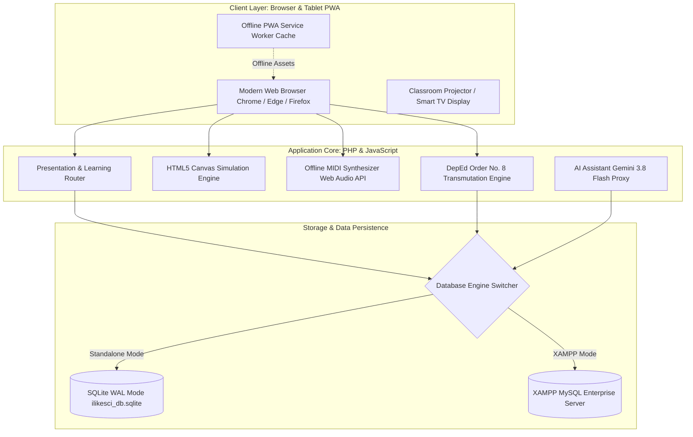
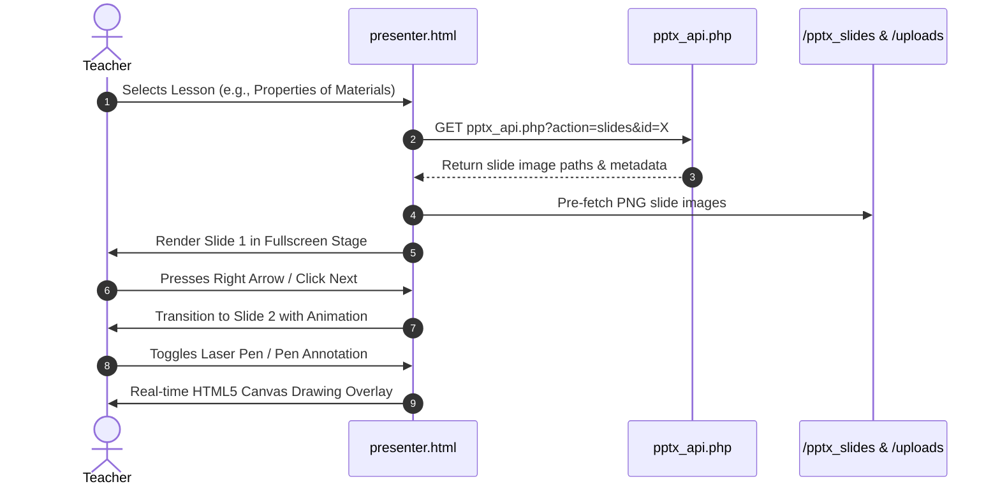
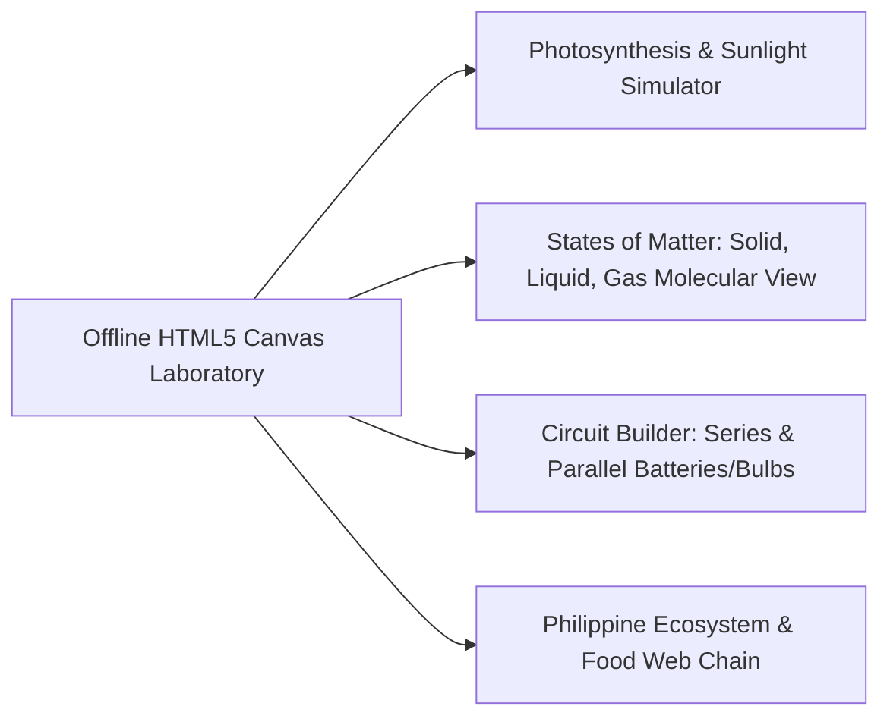
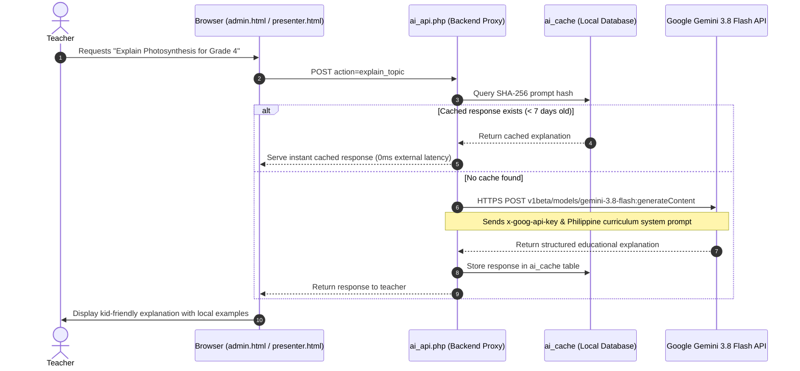

# APPENDIX F: SYSTEM USER MANUAL
## ILikeSci: Interactive Science & Classroom Learning Engine

> **Academic Capstone Project**  
> **Institution:** Laguna State Polytechnic University (LSPU), San Pablo City Campus  
> **College:** College of Computer Studies — Bachelor of Science in Information Technology  
> **Authors:** Abril, Christian Lloyd | Millera, Justine | Olidan, Marc Joshua  
> **Target School:** Bay Central Elementary School (BCES), Bay, Laguna  
> **Target Curriculum:** DepEd K-12 Science Curriculum (Grades 3, 4, 5, and 6)  
> **Version:** 2.4.0 Production Release | Academic Year 2026–2027  

---

## TABLE OF CONTENTS

1. [System Overview & Architecture](#1-system-overview--architecture)
2. [Hardware & Software System Requirements](#2-hardware--software-system-requirements)
3. [Installation & Launching Guide](#3-installation--launching-guide)
   - [3.1 Mode A: One-Click XAMPP Localhost (Recommended for School Labs)](#31-mode-a-one-click-xampp-localhost-recommended-for-school-labs)
   - [3.2 Mode B: Ultra-Low RAM Standalone Mode (For Older Teacher Laptops)](#32-mode-b-ultra-low-ram-standalone-mode-for-older-teacher-laptops)
   - [3.3 Mode C: Standalone Interactive Control Panel](#33-mode-c-standalone-interactive-control-panel)
   - [3.4 Mode D: Cloud Production Deployment (AWS EC2 / HTTPS)](#34-mode-d-cloud-production-deployment-aws-ec2--https)
4. [User Roles, Authentication & Access Security](#4-user-roles-authentication--access-security)
   - [4.1 Default Accounts & Credentials](#41-default-accounts--credentials)
   - [4.2 Teacher Access Isolation & Safeguards](#42-teacher-access-isolation--safeguards)
5. [Step-by-Step Module Walkthrough](#5-step-by-step-module-walkthrough)
   - [5.1 Main Learning Portal & Dashboard (`index.html`)](#51-main-learning-portal--dashboard-indexhtml)
   - [5.2 Interactive Lesson Presenter (`presenter.html`)](#52-interactive-lesson-presenter-presenterhtml)
   - [5.3 Curriculum Lesson Builder & Slide Manager (`lessons.html`)](#53-curriculum-lesson-builder--slide-manager-lessonshtml)
   - [5.4 Classroom Recitation Wheel & Assessment Engine (`assessment.html`)](#54-classroom-recitation-wheel--assessment-engine-assessmenthtml)
   - [5.5 Official Student Roster & Masterlist Management (`students.html`)](#55-official-student-roster--masterlist-management-studentshtml)
   - [5.6 DepEd E-Class Record & Automated Transmutation (`records.html`)](#56-deped-e-class-record--automated-transmutation-recordshtml)
   - [5.7 Offline HTML5 Science Simulations (`multimedia.html`)](#57-offline-html5-science-simulations-multimediahtml)
   - [5.8 Gamified Classroom Science Activities (`games.html`)](#58-gamified-classroom-science-activities-gameshtml)
   - [5.9 Class Scoreboard & Performance Leaderboard (`scoreboard.html`)](#59-class-scoreboard--performance-leaderboard-scoreboardhtml)
   - [5.10 Big-Screen TV / Projector Display Mode (`tv_display.html`)](#510-big-screen-tv--projector-display-mode-tv_displayhtml)
   - [5.11 Teacher Profile & Credential Management (`profile.html`)](#511-teacher-profile--credential-management-profilehtml)
   - [5.12 Central Administrative Management Suite (`admin.html`)](#512-central-administrative-management-suite-adminhtml)
6. [AI Teaching Assistant Configuration (Google Gemini 3.8 Flash)](#6-ai-teaching-assistant-configuration-google-gemini-38-flash)
7. [System Maintenance, Backups & Troubleshooting](#7-system-maintenance-backups--troubleshooting)
8. [Frequently Asked Questions (FAQ)](#8-frequently-asked-questions-faq)

---

## 1. SYSTEM OVERVIEW & ARCHITECTURE

**ILikeSci** is an interactive, hybrid offline/online Science Learning and Classroom Management Engine developed specifically for public elementary classrooms in the Philippines. It addresses real-world infrastructural challenges faced by public elementary schools: intermittent or absent internet connectivity, low-specification teacher laptops, and strict compliance with the **Philippine Department of Education (DepEd)** curriculum standards.



### Core Architecture Highlights:
- **Zero-Dependency Portable Operation:** The system runs out-of-the-box using PHP's built-in engine paired with an optimized SQLite database (`ilikesci_db.sqlite`).
- **High-Performance Database Engine:** Runs in SQLite Write-Ahead Logging (`WAL`) mode with memory caching and indexed foreign keys (average query latency: **0.014 ms / query**).
- **Official Masterlist Ingestion:** Pre-populated with official Bay Central Elementary School (BCES) learner rosters for Grade 4 (Einstein, Newton, Galileo, Pasteur) and Grade 6 (Diamond, Ruby, Emerald, Sapphire).
- **Strict DepEd Order No. 8, s. 2015 Compliance:** Automatically transmutes raw scores according to official DepEd Science weights: **Written Work 40% | Performance Tasks 40% | Quarterly Assessment 20%**.

---

## 2. HARDWARE & SOFTWARE SYSTEM REQUIREMENTS

ILikeSci is engineered specifically to operate reliably on budget, low-end computers commonly deployed in Philippine public schools (such as DepEd Computerization Program DCP laptops).

| Component | Minimum Specification (Standalone Offline) | Recommended Specification (XAMPP / Server) |
|---|---|---|
| **Processor (CPU)** | Intel Celeron N4000 / AMD A4 (Dual Core, 1.1 GHz) | Intel Core i3 / Ryzen 3 or higher |
| **Random Access Memory (RAM)** | **2 GB RAM** (App consumes ~18 MB in RAM) | 4 GB to 8 GB RAM |
| **Storage (Disk Space)** | 500 MB free space (SSD or HDD) | 1 GB free space |
| **Operating System** | Windows 7 / 8.1 / 10 / 11 (32-bit or 64-bit) | Windows 10/11 or Ubuntu Linux 22.04 LTS |
| **Display Resolution** | 1024 x 768 (XGA) | 1920 x 1080 (Full HD) |
| **Supported Browsers** | Google Chrome 80+, Microsoft Edge 80+, Mozilla Firefox 75+ | Google Chrome (Latest) / Edge (Latest) |
| **Web Server & Runtime** | Built-in PHP 7.4+ or 8.0+ CLI (Zero Install) | XAMPP 8.0+ (Apache 2.4 + PHP 8.1 + MySQL 8.0) |
| **Network** | **100% Offline (No Internet Connection Required)** | Local Area Network (LAN / Wi-Fi Hotspot) |

---

## 3. INSTALLATION & LAUNCHING GUIDE

ILikeSci includes automated Windows batch launchers located in the project root directory. Teachers and school ICT coordinators do not need to configure command prompts or databases manually.

### 3.1 Mode A: One-Click XAMPP Localhost (Recommended for School Labs)
When XAMPP is installed on the school PC, this launcher automatically initializes Apache and MySQL services, tests connectivity, and launches the portal in your default browser.

1. Navigate to the project root directory: `C:\xampp\htdocs\ILikeSci\` (or custom installation folder).
2. Double-click the file:
   ```bat
   start_localhost.bat
   ```
3. The script performs the following automated steps:
   - Detects XAMPP installation directory.
   - Starts Apache (Port 80) and MySQL (Port 3306) in the background.
   - Verifies the database tables.
   - Launches your default web browser automatically at:  
     `http://localhost/ILikeSci/index.html`

### 3.2 Mode B: Ultra-Low RAM Standalone Mode (For Older Teacher Laptops)
This mode requires **no XAMPP, no Apache, and no MySQL server**. It uses PHP's built-in web server with SQLite, consuming less than **18 MB of RAM**.

1. Double-click the file:
   ```bat
   start_ilikesci.bat
   ```
2. The terminal window will start the lightweight server on port `8000`.
3. Your browser will automatically open:  
   `http://127.0.0.1:8000`
4. *Note: Keep the small black terminal window minimized while using the system. Close the window when finished to shut down the server.*

### 3.3 Mode C: Standalone Interactive Control Panel
For school ICT administrators who desire manual control over individual services:

1. Double-click:
   ```bat
   standalone_control_panel.bat
   ```
2. An interactive text menu displays real-time statuses:
   - `[1] Start Ultra-Low RAM Mode (127.0.0.1:8000)`
   - `[2] Start Full XAMPP Stack (Apache + MySQL)`
   - `[3] Stop All Running Servers`
   - `[4] Run Full System Diagnostics & Production Test Suite`
   - `[5] Re-seed Database with Official Masterlists & Lessons`
   - `[6] Exit`

### 3.4 Mode D: Cloud Production Deployment (AWS EC2 / HTTPS)
When deployed to the cloud, teachers and students can access the system from anywhere over the internet:
- **Production URL:** `https://ilikesci.duckdns.org`
- **Security:** 256-bit TLS/SSL encryption managed by Let's Encrypt Certbot.
- **Web Server:** Nginx reverse proxy with PHP-FPM 8.2 on Amazon Linux 2023.

---

## 4. USER ROLES, AUTHENTICATION & ACCESS SECURITY

### 4.1 Default Accounts & Credentials

The system comes pre-seeded with dedicated role-based accounts:

| Role | Username | Password | Scope & Grade Level |
|---|---|---|---|
| **School Administrator** | `oyo` | `admin123` | Full Administrative & ICT Oversight across all Grades (3–6) |
| **Primary Teacher (Grade 4)** | `coney` | `Password123!` | Bay Central ES Grade 4 Science Teacher (Einstein, Newton, Galileo, Pasteur) |
| **Secondary Teacher (Grade 6)** | `tine` | `teacher123` | Bay Central ES Grade 6 Science Teacher (Diamond, Ruby, Emerald, Sapphire) |

> **Security Notice:** New teacher accounts can register via `signup.html`. Upon initial registration, accounts must follow secure password complexity rules (minimum 8 characters, uppercase, lowercase, numbers, and special symbols).

### 4.2 Teacher Access Isolation & Safeguards

To prevent cross-grade grade tampering, unauthorized lesson alterations, or accidental student data loss, ILikeSci enforces strict **Teacher Load Isolation** (`Session 18 Hardening`):

1. **Assigned Teaching Load Protection:** Non-admin teachers cannot alter their assigned grade or section in `profile.html`. Ma'am Coney's account is permanently locked to Grade 4 with a visible badge: `(Managed by School Administrator)`.
2. **Grade-Level Content Scoping:** When Teacher Coney logs in:
   - Question bank displays only Grade 4 questions.
   - Curriculum lessons and visual slide presentations display only Grade 4 materials.
   - Presentation deletions or modifications of other grades are blocked at the server level with `403 Forbidden`.
3. **Student Roster Integrity:** Teachers can only view and evaluate students assigned to their designated grade level. Grade 7 records have been permanently purged and are rejected by API validation.
4. **Cascading Referential Deletion:** Deleting a student automatically purges related recitation and grade rows, eliminating database corruption or orphaned records.
5. **Admin Safeguards:** The primary teacher account (`coney`) and the last remaining school administrator account (`oyo`) are protected against accidental deletion or renaming.

---

## 5. STEP-BY-STEP MODULE WALKTHROUGH

### 5.1 Main Learning Portal & Dashboard (`index.html`)

The dashboard serves as the central command portal for classroom activities.

```
+-----------------------------------------------------------------------------------+
|  [ATOM ICON] ILikeSci                               [Learn] [Practice] [Scoreboard]  [Moon] [Door] |
+-----------------------------------------------------------------------------------+
|                                                                                   |
|   WELCOME BACK, MA'AM CONEY! (Grade 4 Science Teacher)                            |
|                                                                                   |
|   +-------------------+  +-------------------+  +-------------------+              |
|   | 📚 Lesson Slides  |  | 🎯 Flash Quiz     |  | 🎡 Recitation     |              |
|   | 277 Visual Slides |  | 20 Bank Questions |  | Randomizer Wheel  |              |
|   +-------------------+  +-------------------+  +-------------------+              |
|   +-------------------+  +-------------------+  +-------------------+              |
|   | 🧪 Lab Simulation |  | 📊 E-Class Record |  | 🎮 Classroom Game |              |
|   | Canvas Experiments|  | DepEd Order No. 8 |  | 4 Pics 1 Word     |              |
|   +-------------------+  +-------------------+  +-------------------+              |
|                                                                                   |
|   CURRICULUM LEARNING PATHWAY (Grade 4 Quarter 1: Matter & Materials)              |
|   [1. Properties of Materials] -> [2. Changes in Matter] -> [3. Assessment]       |
+-----------------------------------------------------------------------------------+
```

#### Key Capabilities:
- **Grade Filtering Dropdown:** Switch between Grade 3, Grade 4, Grade 5, and Grade 6. For logged-in teachers, the dropdown defaults to their assigned teaching load.
- **Module Shortcut Cards:** Fast, one-click access to Presenter, Builder, Recitation, Simulations, E-Class Records, and Classroom Games.
- **Dark Mode / Light Mode Toggle:** Top navigation moon/sun icon switches contrast themes for optimal visibility under classroom ambient lighting.

---

### 5.2 Interactive Lesson Presenter (`presenter.html`)

Designed for classroom projectors and smart TVs, the presenter delivers curriculum slide presentations without requiring Microsoft PowerPoint or internet access.



#### Classroom Controls:
- **Slide Navigation:** Use keyboard arrow keys (`Left` / `Right`), on-screen buttons, or a wireless presenter clicker.
- **Interactive Annotation Pen:** Draw directly over slides to emphasize key scientific vocabulary or diagrams.
- **Laser Pointer Mode:** Highlights focal points on the projector screen.
- **Slide Thumbnail Drawer:** Press `T` or click the grid icon to open a visual tray of all slides for jumping across sections.
- **Classroom Timer:** Built-in floating countdown timer for group activities and timed discussions.

---

### 5.3 Curriculum Lesson Builder & Slide Manager (`lessons.html`)

Allows teachers to customize lessons, adjust slide sequences, upload visual illustrations, or create entirely new curriculum units.

1. Navigate to **Lessons** from the admin or navigation menu.
2. Select **Quarter** and **Topic**.
3. Click **Add New Slide** to append content:
   - Provide Slide Title and Scientific Concepts.
   - Attach diagrams or illustrations from the multimedia repository.
   - Choose layout: Title Slide, Definition & Concept, Side-by-Side Comparison, or Question Prompt.
4. Click **Save Changes**. The lesson is instantly updated in the local database and ready for presentation.

---

### 5.4 Classroom Recitation Wheel & Assessment Engine (`assessment.html`)

The recitation module gamifies classroom participation, preventing student anxiety through fair, randomized selection while tracking attendance and oral recitation scores.

```
+-----------------------------------------------------------------------------------+
|  🎡 RECITATION RANDOMIZER & QUIZ ENGINE                                           |
+---------------------------------------------------+-------------------------------+
|                                                   |  SELECTED STUDENT:            |
|                     [  WHEEL  ]                   |  ALVAREZ, SOFIA MAE           |
|                  /             \                  |  Section: Einstein (Grade 4)  |
|                 |    SPIN ME    |                 |                               |
|                  \             /                  |  Question:                    |
|                     [  WHEEL  ]                   |  What state of matter has a   |
|                                                   |  definite shape and volume?   |
|             [ BUTTON: SPIN THE WHEEL ]            |                               |
|                                                   |  [A] Solid     [B] Liquid     |
|                                                   |  [C] Gas       [D] Plasma     |
|                                                   |                               |
|  Recitation Scoring:                              |  Score: [ +1 ] [ +2 ] [ +3 ]  |
|  [ ] Correct Answer   [ ] Partial   [ ] Pass      |  [ SUBMIT RECITATION SCORE ]  |
+---------------------------------------------------+-------------------------------+
```

#### Step-by-Step Procedure:
1. Select **Grade** (locked to Grade 4 for Ma'am Coney) and **Section** (e.g., Einstein).
2. Click **Spin the Wheel**. The canvas spins and selects a student at random from the official section roster.
3. An official DepEd Science question appears on screen.
4. The student answers verbally. The teacher clicks the rubric score (`1`, `2`, or `3` points).
5. The score is immediately recorded to the database and reflected on the student's recitation history.

---

### 5.5 Official Student Roster & Masterlist Management (`students.html`)

Houses the official masterlist of 478 elementary learners from Bay Central Elementary School.

```
+-----------------------------------------------------------------------------------+
|  STUDENT DIRECTORY & ROSTER                                  [+ Add New Student]  |
|  Filter Grade: [ Grade 4  v ]   Filter Section: [ Einstein v ]   Search: [_______] |
+-----+-----------------------------------+-------+----------+--------+-------------+
| LRN | Student Full Name (DepEd Format)  | Grade | Section  | Recit. | Actions     |
+-----+-----------------------------------+-------+----------+--------+-------------+
| 001 | ABRIL, JOHN CARLO M.             | 4     | Einstein | 4      | [Edit] [Del]|
| 002 | ALVAREZ, SOFIA MAE D.             | 4     | Einstein | 7      | [Edit] [Del]|
| 003 | BALMES, CHRISTIAN DAVE P.         | 4     | Einstein | 3      | [Edit] [Del]|
| 004 | CASTILLO, PRINCESS NICOLE R.      | 4     | Einstein | 6      | [Edit] [Del]|
+-----+-----------------------------------+-------+----------+--------+-------------+
```

#### Official School Sections:
- **Grade 4 Sections:** `Einstein`, `Newton`, `Galileo`, `Pasteur`
- **Grade 6 Sections:** `Diamond`, `Ruby`, `Emerald`, `Sapphire`

#### Adding or Editing Learners:
1. Click **+ Add New Student**.
2. Enter the student's official Learner Reference Number (LRN), Last Name, First Name, and Middle Initial.
3. Select Grade and Section.
4. Click **Save Student**. The dual-engine upsert handler writes the learner to the database.

---

### 5.6 DepEd E-Class Record & Automated Transmutation (`records.html`)

This module eliminates manual grading calculations by strictly executing the official **DepEd Order No. 8, s. 2015** policy guidelines for Science.

#### Science Grading Weights (DepEd Order No. 8):
$$\text{Initial Grade} = (\text{Weighted Written Work Score}) + (\text{Weighted Performance Task Score}) + (\text{Weighted Quarterly Assessment Score})$$

Where:
$$\text{Written Work (WW)} = 40\% \quad | \quad \text{Performance Tasks (PT)} = 40\% \quad | \quad \text{Quarterly Assessment (QA)} = 20\%$$

#### Official Transmutation Formula:
The raw score percentage is automatically transmuted into the final DepEd quarterly grade:

| Raw Score Percentage | Transmuted Grade | DepEd Descriptor |
|---|---|---|
| **100%** | **100** | Outstanding |
| **98.40 – 99.99%** | **99** | Outstanding |
| **90.00 – 91.59%** | **94** | Outstanding |
| **85.00 – 86.59%** | **90** | Very Satisfactory |
| **75.00 – 76.99%** | **84** | Satisfactory |
| **60.00 – 61.59%** | **75** | Fairly Satisfactory (Passing Mark) |
| **Below 60.00%** | **Below 75** | Did Not Meet Expectations |

#### Exporting to DepEd CSV / Excel:
1. Select **Grade**, **Section**, and **Quarter (Q1 - Q4)**.
2. Enter or review raw scores for Written Work, Performance Tasks, and Quarterly Exams.
3. Click **Export Records (CSV)**.
4. The system produces an official `.csv` file with pre-calculated initial scores, transmuted grades, and proficiency remarks, ready for DepEd Form 137 / SF9 transfer.

---

### 5.7 Offline HTML5 Science Simulations (`multimedia.html`)

The simulation laboratory runs at a locked 60 frames per second using hardware-accelerated HTML5 Canvas. It operates 100% offline without Flash, external plugins, or WebGL dependencies.



1. **States of Matter Simulator:** Students alter temperatures using an interactive slider to observe water molecules transition from compact vibrating crystal structures (Solid Ice) to fluid slipping particles (Liquid Water) and high-velocity bouncing molecules (Water Vapor).
2. **Circuit Builder:** Learners drag batteries, copper switches, resistors, and light bulbs onto a breadboard to observe live electrical currents and circuit breaks.
3. **Photosynthesis Reactor:** Allows students to alter carbon dioxide and sunlight levels to measure oxygen generation bubbles.

---

### 5.8 Gamified Classroom Science Activities (`games.html`)

Designed for interactive smartboards, tablets, or projector participation:

1. **4 Pics 1 Word Science Edition:** Four high-definition scientific images appear on screen. Students unscramble letter tiles to identify the underlying concept (e.g., *Condensation*, *Evaporation*, *Mixture*).
2. **Periodic Table Quest:** A fast-paced element matching challenge teaching elementary symbols (O, H, Fe, Au, C, Na).
3. **Science Groupings Generator:** Automatically balances the class roster into collaborative lab teams (3–6 students per group) with random assignment.

---

### 5.9 Class Scoreboard & Performance Leaderboard (`scoreboard.html`)

- Displays classroom star rankings, recitation achievements, and badge collections.
- Includes a dedicated **Print Scoreboard** stylesheet formatted with high-contrast text for physical classroom bulletin board posting.

---

### 5.10 Big-Screen TV / Projector Display Mode (`tv_display.html`)

A specialized, ultra-clean presentation layout stripped of browser scrollbars and administrative buttons, tailored specifically for HDMI television outputs and classroom projectors.

---

### 5.11 Teacher Profile & Credential Management (`profile.html`)

- **View Teaching Load:** Displays active teacher assignment. For Ma'am Coney, Grade 4 is locked and protected.
- **Update Password:** Allows teachers to update their credentials while enforcing minimum password entropy.
- **Offline Theme Preferences:** Remembers dark/light theme choices across sessions.

---

### 5.12 Central Administrative Management Suite (`admin.html`)

Restricted strictly to the School Administrator (`oyo`). Access by non-admin accounts results in an automatic `403 Forbidden` response.

```
+-----------------------------------------------------------------------------------+
|  ILIKESCI CENTRAL ADMINISTRATIVE CONSOLE                                          |
|  [ Dashboard ]  [ Users ]  [ Questions ]  [ Files ]  [ E-Class ]  [ Settings ]     |
+-----------------------------------------------------------------------------------+
|  SYSTEM OVERVIEW METRICS:                                                         |
|  * Total Students: 478 active BCES learners                                       |
|  * Curriculum Lessons: 54 fully sequenced units                                   |
|  * Presentation Slides: 277 visual slide decks                                    |
|  * AI Engine Status: Connected (Google Gemini 3.8 Flash via PHP proxy)             |
|                                                                                   |
|  MANAGED ACTIONS:                                                                 |
|  [ + Create Teacher Account ]   [ 🔄 Clear AI Response Cache ]                     |
|  [ 💾 Create System Backup ]    [ 📥 Export Database SQL/SQLite ]                 |
+-----------------------------------------------------------------------------------+
```

---

## 6. AI TEACHING ASSISTANT CONFIGURATION (GOOGLE GEMINI 3.8 FLASH)

ILikeSci integrates an AI Teaching Assistant that aids educators in question generation, kid-friendly topic explanations, and individualized study hints.



### Configuration Parameters (`ai_config.php`):
- **Provider:** `gemini`
- **Active Model:** `gemini-3.8-flash`
- **System Prompt:** Enforces DepEd K-12 Philippine curriculum context, clear simple English, and local real-world examples (e.g., mango trees, malunggay leaves, local weather).
- **Graceful Offline Fallback:** If internet is disconnected or the API key is not present, all core platform features (lessons, presentations, recitation wheel, E-Class records, simulations) remain **100% operational**.

---

## 7. SYSTEM MAINTENANCE, BACKUPS & TROUBLESHOOTING

### 7.1 Creating Automated Database Backups
- **Localhost Backup:** Simply copy the file `ilikesci_db.sqlite` to a USB flash drive or backup folder.
- **EC2 Cloud Backup:** Run `deploy_to_ec2.ps1`. The script automatically generates a timestamped remote snapshot (e.g., `ilikesci_db.sqlite.backup_20261005_235219`) before any update is applied.

### 7.2 Running Automated Diagnostic Audits
To verify complete system integrity on any host machine:
```bash
php test_production_readiness.php
```
*Executes all 53 automated database, API, authentication, slide rendering, and DepEd calculation audits.*

To verify foolproofing safeguards:
```bash
php scratch/test_safeguards.php
```
*Validates that cross-grade deletion, teacher profile modification, and invalid section saves are completely blocked.*

---

## 8. FREQUENTLY ASKED QUESTIONS (FAQ)

**Q1: Can ILikeSci run without any internet connection?**  
**A:** Yes. All slide decks, lesson builder tools, recitation wheels, student masterlists, grading records, MIDI songs, and HTML5 simulations run 100% offline. Internet is only utilized when actively triggering the AI assistant generation features.

**Q2: What happens if two teachers use the system on the same school Wi-Fi?**  
**A:** When running via XAMPP or EC2, multiple teachers can connect simultaneously from their laptops or tablets using the server's IP address (e.g., `http://192.168.1.100/ILikeSci/index.html`). Teacher Coney will only see Grade 4, while Teacher Tine will only see Grade 6.

**Q3: How are student scores transferred to the official DepEd electronic grading sheet?**  
**A:** Navigate to `records.html`, select your section, and click **Export Records (CSV)**. Open the downloaded file in Microsoft Excel and copy the transmuted grades directly into the DepEd official E-Class Record template.

---

*(End of Appendix F — System User Manual)*
