# ILikeSci — admin.html Flowchart

> **Scope:** This document covers only `admin.html` — the Administrator Panel page of the ILikeSci system.
> Each section has a **plain-language explanation** followed by the **flowchart diagram** for visual reference.

---

## 1. Page Entry Flow

### 📝 In Plain Words

When someone opens `admin.html` in their browser, the very first thing that happens is the browser downloads and assembles all the building blocks of the page — the stylesheet (`styles.css`), icon library (Font Awesome), the Google font (Outfit), and the two JavaScript files (`app.js` and `mobile-optimizations.js`). Once everything is loaded, the page draws the navigation bar at the top, then renders the main admin panel below it. By default, the **Dashboard tab** is the first one shown, and the system immediately calls `app.loadAdminStats()` to start pulling live data from the server.

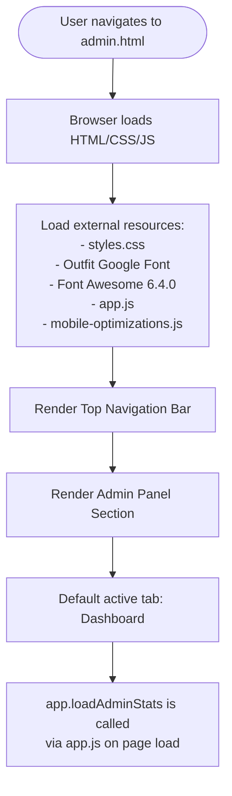

---

## 2. Top Navigation Bar

### 📝 In Plain Words

The navigation bar at the top is split into three parts. On the **left** is the ILikeSci brand logo (an atom icon). In the **center** are three buttons that take the user to other pages: Learn, Practice, and Leaderboard. On the **right** side are personal controls: clicking the avatar goes to the profile page, the moon icon toggles light/dark theme, and the door icon logs the user out.

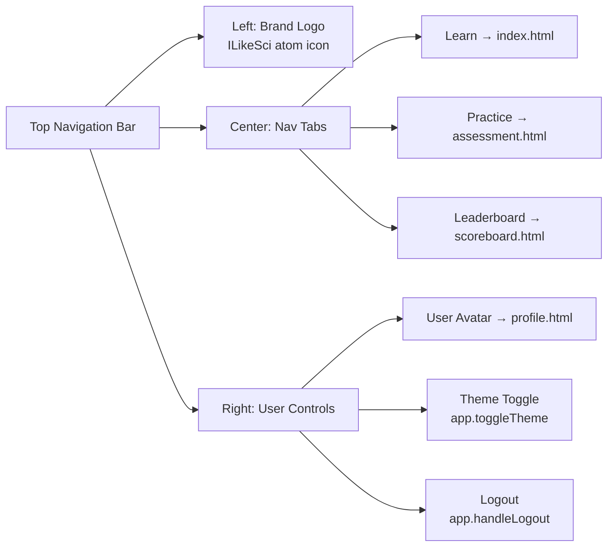

---

## 3. Admin Panel Tab Switching (`switchAdminTab`)

### 📝 In Plain Words

The admin panel has **six tabs** at the top: Dashboard, Users, Questions, Files, E-Class, and Settings. When the admin clicks any tab, the system first clears all currently active highlights, then highlights the tab the admin just clicked and reveals its matching content panel. After that, depending on which tab was selected, it automatically fetches the right data. For example, clicking **Users** triggers `app.loadAdminUsers()`, while clicking **Settings** triggers both `app.loadSystemSettings()` and `loadAIAdminStatus()`. The **Files** tab is the only one that does NOT auto-load anything — the admin has to click a button manually.

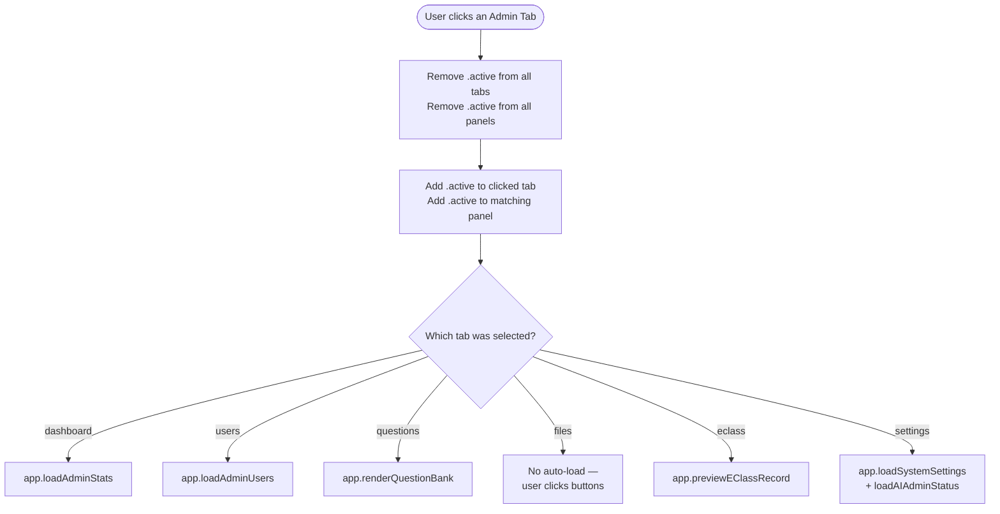

---

## 4. TAB: Dashboard

### 📝 In Plain Words

When the Dashboard tab is open (or when the page first loads), a spinning loader appears while the system silently contacts the server in the background. Once the server responds, the loader disappears and is replaced by a grid of **stat cards** — small boxes showing important numbers like total students, questions in the bank, sessions today, and total scores. Below the stat cards is a list of the **most recent recitations** so the admin can quickly see what students have been doing lately. If the server fails to respond, the page shows an empty or error state instead.

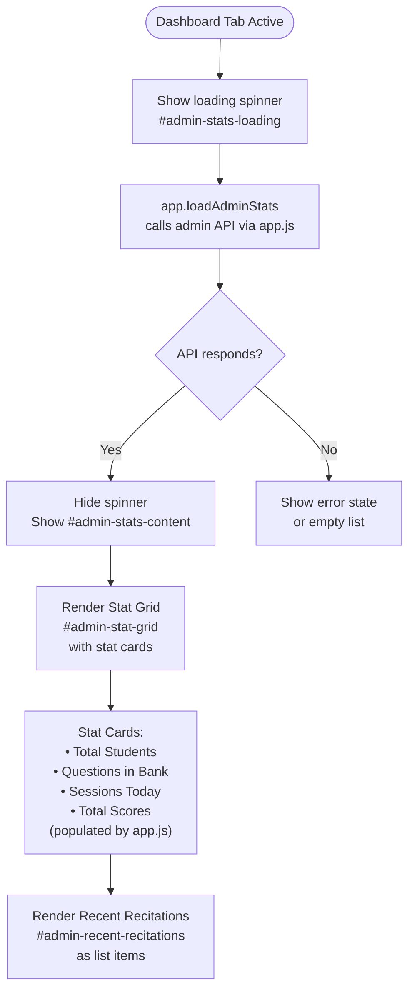

---

## 5. TAB: Users

### 📝 In Plain Words

The Users tab has two main areas. At the **top** is the Add New User form — it is always visible and lets the admin type in a username, display name, optional email, password, and choose a role (Teacher or Admin). When the admin clicks **Add**, the system checks if all required fields are filled in. If valid, it sends the new user data to the server and refreshes the table. If not, it shows a validation error.

At the **bottom** is the full user table. When the tab opens, a spinner shows while user records are fetched from the server. Once loaded, the table displays every user with their details. Each row has two action buttons: **Edit** (opens a popup modal to change the user's info) and **Delete** (shows a confirmation prompt before removing the user permanently).

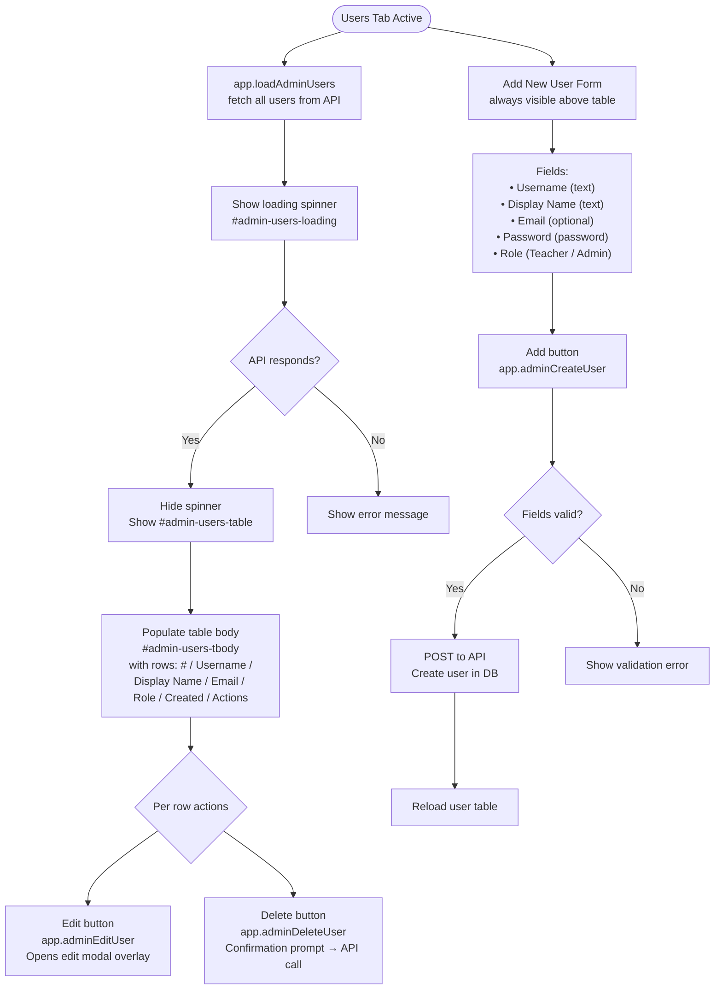

### 5a. Edit User Modal

### 📝 In Plain Words

When the admin clicks the **Edit** button on any user row, a dark overlay appears over the whole screen with a small popup form in the center. The admin can change the user's display name, email, role, or set a new password (the password field is optional — leaving it blank keeps the old one). If the admin clicks **Save**, the data is sent to the server and the table reloads. If they click **Cancel**, the popup closes and nothing changes.

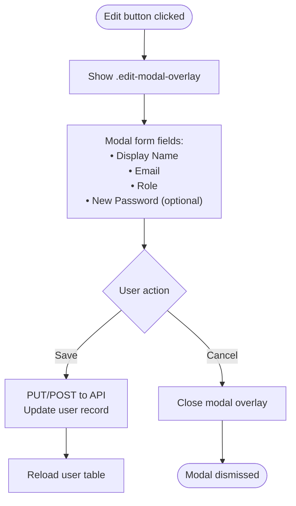

---

## 6. TAB: Questions (Question Bank)

### 📝 In Plain Words

The Questions tab is where the admin manages all the science questions stored in the system. When the tab opens, the full list of questions loads automatically. The admin can narrow the list down using two live filters: a **grade-level dropdown** (All, Grade 3–6) and a **keyword search box** (searches by topic or question text). Both filters react immediately as the admin types or selects — no need to click a search button. Each question in the list shows the question text, its grade, difficulty, and type, with Edit and Delete actions per item. There is also an **Export CSV** button that downloads all currently filtered questions as a spreadsheet file.

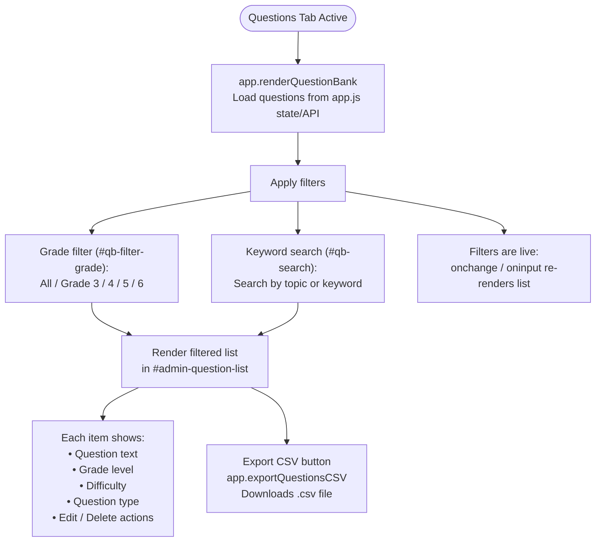

---

## 7. TAB: Files (File Manager)

### 📝 In Plain Words

The Files tab is the data management hub. Nothing loads automatically when you switch to it — the admin must interact manually. There are four buttons in the first card:

- **Export Data** — opens a modal where you pick a grade and format, then downloads a filtered file.
- **Import File** — opens a modal to upload a file and merge it into the system.
- **Quick Backup (JSON)** — instantly downloads the entire system data as a single JSON file.
- **Quick Restore (JSON)** — opens a file picker to upload a previously saved JSON backup and restore data from it.

A second card handles **Database Sync** — the admin can either **Push** (send local data up to the MySQL database) or **Pull** (fetch the database records back down to the local state).

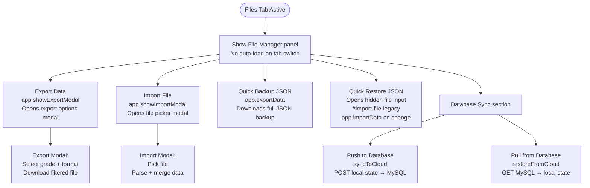

---

## 8. TAB: E-Class Record Export

### 📝 In Plain Words

This tab is specifically for generating the official **DepEd E-Class Record** report. As soon as the admin opens this tab, the system automatically calls `app.previewEClassRecord()` to show a preview based on the default filter values. The admin can change three filters — **Grade**, **Section** (A/B/C/D), and **Quarter** (1–4) — and a preview table updates to show the matching students and their computed grades. The grade calculation strictly follows **DepEd Order 8, s. 2015**: Written Work counts for 40%, Performance Tasks for 40%, and the Quarterly Assessment for 20%. These are combined into an Initial Grade, which is then transmuted into the final grade. Once the admin is happy with the preview, clicking **Download CSV** saves the table as a properly formatted spreadsheet ready for submission.

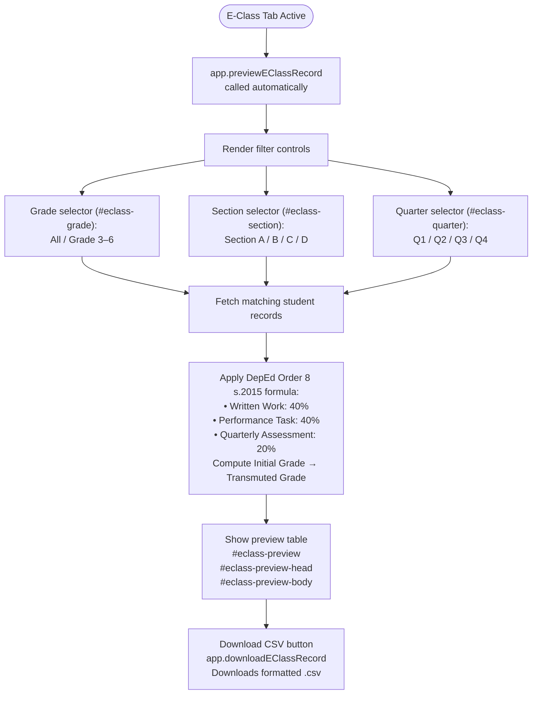

---

## 9. TAB: Settings

### 📝 In Plain Words

The Settings tab is divided into three cards, all of which load data when the tab is opened.

**Card 1 — System Settings:** The admin can set how many points each difficulty level is worth (Easy, Medium, Hard). The defaults are 1, 3, and 5. Clicking **Save Settings** sends these values to the server/localStorage so the whole system respects them.

**Card 2 — Aggregated Reports:** The admin selects a grade level and clicks **Generate Report** to produce a text-based summary of student performance for that grade. The output appears in a scrollable box below the button.

**Card 3 — AI Settings:** This card checks the status of the connected AI service (Groq or Gemini) by calling `ai_api.php`. It shows the provider name, model, language, rate limit, and how many responses are cached. If no API key has been configured in `ai_config.php`, a red warning banner appears. Two buttons let the admin **Test Connection** (runs the status check again) or **Clear AI Cache** (after a confirmation dialog, deletes all stored AI responses and shows a success or error alert).

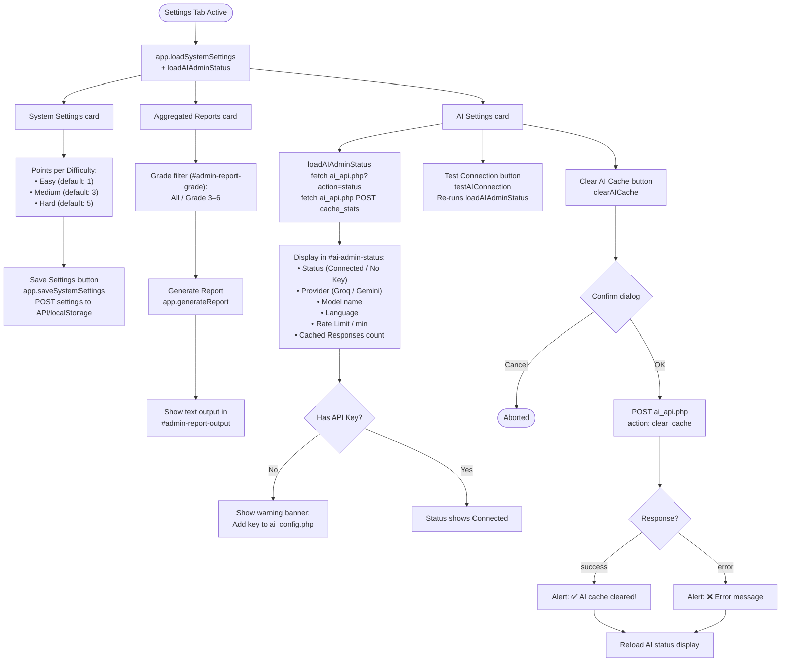

---

## 10. TV Mode

### 📝 In Plain Words

At the top of the admin panel page, next to the subtitle text, there is a small **TV Mode** button. Clicking it calls `app.openTVDisplay()`, which opens a new browser window or tab in a special full-screen presentation view. This view is designed to be shown on a classroom TV or projector, displaying live student data in a large, readable format.

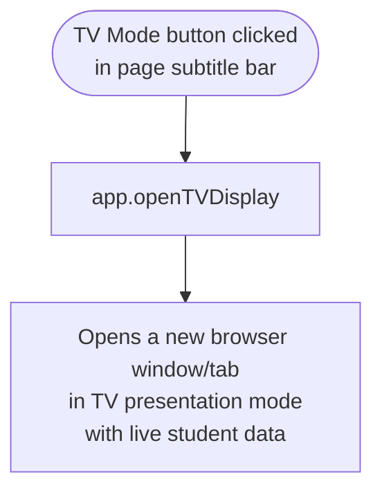

---

## 11. Script Dependencies Overview

### 📝 In Plain Words

`admin.html` does not contain most of its logic directly — it delegates almost everything to other files. The page has a small **inline script block** that defines only four functions used specifically on this page: `switchAdminTab()`, `loadAIAdminStatus()`, `testAIConnection()`, and `clearAICache()`. All the heavy lifting (user management, stats, question bank, grade export, etc.) lives inside **`app.js`**, which is loaded as a separate file. **`mobile-optimizations.js`** handles touch and responsive behaviour. The two backend APIs (`admin_api.php` for user/stats data and `ai_api.php` for AI features) are called over HTTP by both `app.js` and the inline script.

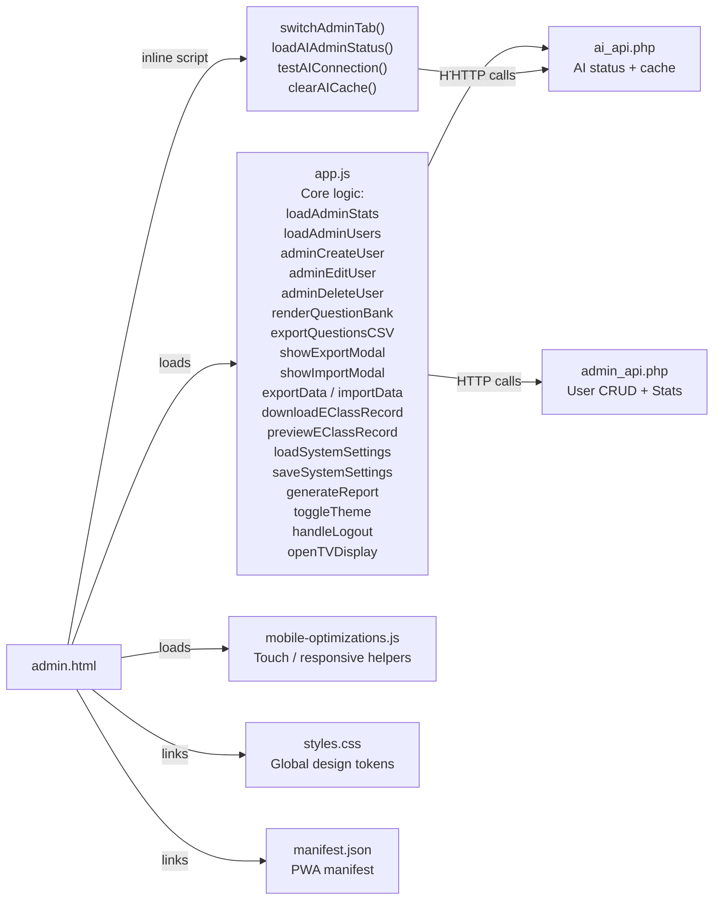

---

## 12. Full Page Flow Summary

### 📝 In Plain Words

To sum up the whole page in one picture: the admin opens `admin.html`, the page loads and draws itself, and the Dashboard is shown by default with live stats already being fetched. From that point on, the admin is in full control — they can click any of the six tabs to switch to a different function. Each tab is independent: switching to it shows different content and triggers a different data-load. The admin can freely move between tabs at any time, and the system always fetches fresh data when a tab becomes active. There is no fixed order or forced workflow — the admin panel is a free-navigation control room.

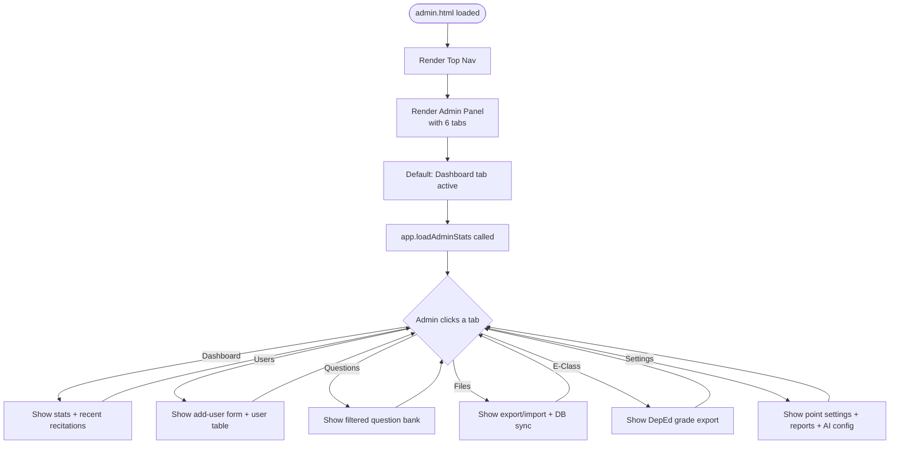

---

*Last updated: 2026-05-26 | File: `admin.html` | Project: ILikeSci*
